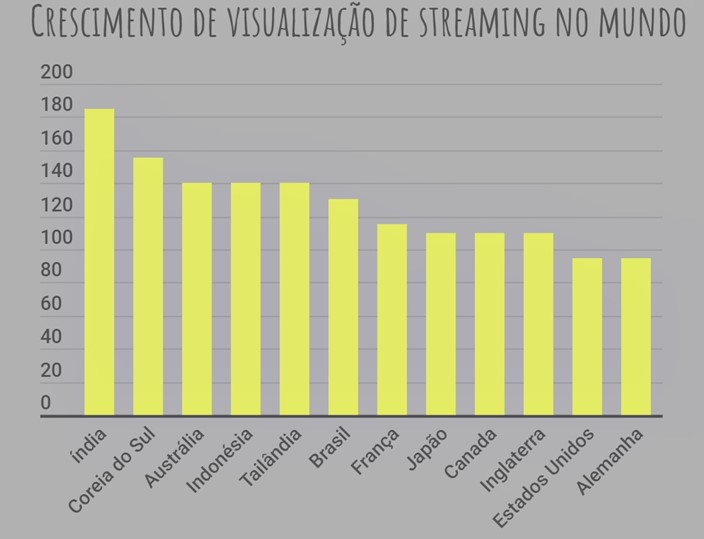
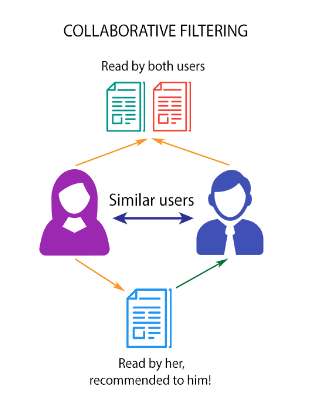
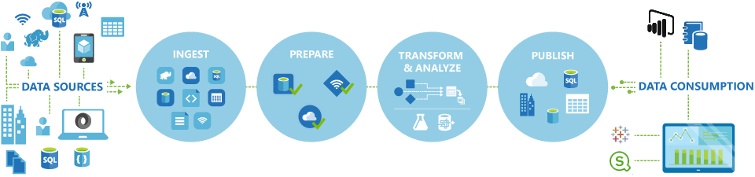

# Projeto Trabalho de Graduação em Banco de Dados I

## TEMA:  Movie-Show Advisor: Sistemas de Recomendação de streamings (filmes e séries) 🎥
<h1 align="center">
    
</h1>

### 1. INTRODUÇÃO

O consumo de streamings de vídeos está e constante crescimento em todo mundo, com cenário vivido em 2020 por decorrência COVID-19  fez com que várias partes do mundo adquirissem o isolamento social, medida tomada pela Organização Mundial da Saúde (OMS) como modo a minimizar o contato social, diante disso o consumo de streamings teve um aumento exponencial se transformando em uma das principais formas de entretenimento das pessoas que, confinadas em casa, passaram a ficar mais tempo diante da televisão.
Conforme artigo disponibilizado pelo TecMundo em 12/07/2019 o Brasil era o 6º maior consumidor de streaming de filmes e séries do mundo

-Imagem
<h1 align="center">
    
 <h4>Fonte: Cuponation/Reprodução </h4>
   
</h1>
  
A Índia ocupa o 1º lugar, com mais de 185% de crescimento de visualização, seguida pela Coreia do Sul (+155%); Austrália, Indonésia e Tailândia (todas com +140%).
Com base nas informações divulgadas pela empresa Netflix no final de 2019 o tempo médio gasto por pessoa assistindo à Netflix é superior ao de demais atividades:
  
Neste contexto, de um mundo globalizado onde existe uma diversidade muito grande de produtos de mídia surge a necessidade de uma ferramenta que consiga entender e disponibilizar para os usuários os videos e series mais relevantes, de forma a facilitar o processo de escolha.

  
A experiência de pesquisa é construída em torno de vários algoritmos. Um algoritmo tenta encontrar os vídeos que correspondem a uma determinada consulta, por exemplo, para exibir Friends para a consulta parcial “frien.”. Outro algoritmo prevê interesse em um conceito dado  da consulta parcial, por exemplo, identificando o conceito French Movies para a consulta “fren”. E um terceiro algoritmo encontra recomendações de vídeo para um determinado conceito, por exemplo, para vídeos recomendados sob o conceito French Movies. Os algoritmos de pesquisa combinam reproduzir dados, dados de pesquisa e metadados para chegar aos resultados e recomendações oferecidas.
  
Com o surgimento dos e-commerces, a limitação de espaço físico das lojas foi vencida, fazendo com que seja possível, em uma mesma loja (a Amazon, por exemplo), se ter uma infinidade de produtos dos mais diversos tipos e categorias. E como encontrar algo que buscamos em um ambiente como esse? Imagine se quiséssemos assistir a um filme, abríssemos uma plataforma de streaming e ela nos apresentasse todos os incontáveis filmes de seu catálogo separados por gênero, mas sem uma ordem definida.
  
Encontrar um filme de nosso gosto esté cenario seria uma tarefa muito dificil, demorada e muitos de nós desistiríamos no meio do processo.
Assim surgiram os sistemas de recomendação que, hoje, são muito presentes no nosso dia a dia.
  
Um dos problemas encontrados ao criar algoritmos de recomendação é que, inicialmente, o sistema possui poucas informações do usuário. Isso dificulta a aprendizagem
e o desempenho dos algoritmos. Dessa forma, é necessário utilizar mecanismos que reduzem o tempo de aprendizagem dos algoritmos e prevejam baseado na pouca informação
disponível (GAMA et al., 2011).
  
O mercado de streaming de vídeos movimenta bilhões de dólares por ano no mundo todo e um dos seus principais recursos para evitar a evasão de seus clientes é gerar boas recomendações de obras a serem assistidas. Tão mportante é esta tarefa, que a empresa líder neste mercado, Netflix ®, lançou em 2009 um desafio de 1 milhão de dólares, para desenvolvedores que conseguissem melhorar seu algoritmo de recomendação em 10%.
  
Visando atender a uma necessidade de mercado, ou seja, um sistema de recomendação de filmes e series com predição de nota, que não apenas diga se o usuário irá gostar ou não da obra, mas faça uma predição aproximada da nota que o usuário irá dar para a obra após assistir.

#### 1.1. Objetivos do Trabalho 
O objetivo geral deste trabalho é desenvolver um sistema de recomendação de Filmes e Séries utilizando técnicas de analise de dados.

#### 1.2. Conteúdo do Trabalho
O presente trabalho está estruturado em seis Capítulos, cujo conteúdo é sucintamente apresentado a seguir:

No Capítulo 2 é feita a fundamentação das tecnologias...
O Capítulo 3 apresenta o desenvolvimento da solução...
No Capítulo 4 são apresentados os resultados ...
O Capítulo 5 apresenta as considerações finais deste trabalho a partir da análise dos resultados obtidos...

### 2.	FUNDAMENTAÇÃO TÉCNICA
Este capítulo apresenta temas necessários para compreensão deste trabalho em seu desenvolvimento: Técnologias.

#### 2.1. Levantamento de Requisitos

- Machine Learning
- Sistema de recomendação por filtragem colaborativa
- Sistema de recomendação baseada em conteúdo

O sistema deve suportar dois tipos de filtragem, o primeiro se refere a filtragem baseada e conteudo cujo os usuários informam quais gêneros de filmes/series, atores, diretores eles gostam; se preferem comedia, drama ou ação, dentre ouras características, por fim temos a filtregem colaborativa os usuários iniciam a utilização da plataforma, de acordo com uso avaliam os filmes/series que assistiram, com intuido de pontuar qual os agradou mais.

Em um sistema de recomendação baseado em conteúdo o conhecimento dos produtos e as informações do cliente são levados em consideração e com base no conteúdo que você visualizou na Netflix fornece sugestões semelhantes. Por exemplo, se você assistiu a um filme com um gênero de ficção científica o sistema de recomendação, com base em conteúdo, fornecerá sugestões de filmes semelhantes com o mesmo gênero.

Diferente da filtragem baseada em conteúdo que forneceu recomendações de produtos similares, a Filtragem colaborativa fornece recomendações baseadas nos perfis semelhantes de seus usuários. Uma vantagem importante da filtragem colaborativa é que ela é independente do conhecimento do produto. Em vez disso, conta com os usuários com uma suposição básica de que o que eles gostaram no passado também gostará no futuro. Por exemplo, se uma pessoa A assiste gêneros de crime, ficção científica e suspense e B assiste a gêneros de ficção científica, suspense e ação, então A também gostará de ação e B gostará de gênero de crime.

<h1 align="center">
    
      
    
</h1>
Fonte: http://coral.ufsm.br/pet-si/index.php/sistemas-de-recomendacao-desvendando-uma-parte-da-magica/
 
  
A aplicação backend está exposta como API para ser consumida e comunicar-se com a aplicação frontend, a comunicação segue a arquitetura RESTful e transportando dados no formato JSON.
  
#### 2.2.	Tecnologias utilizadas
Para o desenvolvimento desta aplicação foram escolhidas 5 tecnologias e seus recursos como:

•   Python;

•   Ruby;

•	Jupyter Notebook;

•	K-Nearest Neighbords – (KNN) - (algoritmos  de aprendizagem supervisionada) 

•	Similaridade de cosseno

•	TF-IDF  (Análise estatistica)

•	Banco de dados - A definir

#### 2.2.1.	Python
Linguagem de programação pode ser aplicada em todas as fases da análise de dados, já que ela é bem robusta para programação em geral e tem muitas bibliotecas de apoio, como a própria exploração e a visualização de dados

#### 2.2.2 Jupyter Notebook;
O Jupyter Notebook é uma ferramenta de Literate Computing, extremamente eficientes, pois permitem unir código e texto. Assim cada funcionalidade pode ser explicada detalhadamente. Você também pode gerar gráficos “vivos” gerados em tempo real dentro da ferramenta.

#### 2.2.3 K-Nearest Neighbords – (KNN)
Algoritmos de aprendizagem supervisionada usado no campo de data mining e machine learning, ele é um classificador onde o aprendizado é baseado “no quão similar” é um dado (um vetor) do outro. O treinamento é formado por vetores de n dimensões.

#### 2.2.4 TF-IDF  (Análise estatistica) (Revisar)
O valor tf–idf, é uma medida estatística que tem o intuito de indicar a importância de uma palavra de um documento em relação a uma coleção de documentos ou em um corpus linguístico. Ela é frequentemente utilizada como fator de ponderação na recuperação de informações e na mineração de dados.

#### 2.2.5 Banco de dados - A definir (MySql)

Devido a escalabilidade, flexibilidade, confiabilidade sólida e constante disponibilidade que o servidor de banco de dados MySQL fornece foi feita a utilização deste SGBD (Sistema de Gerenciamento de Banco de Dados) além de sua alta velocidade de carga, caches de memória distintos, índices de texto completo, e outros mecanismos que satisfaz as expectativas de desempenho exigidas nos requisitos.

Também, o SGBD possui o código-fonte open source e gratuito, possuindo uma grande comunidade envolvida na busca de soluções e melhorias

#### 2.3.	Soluções Existentes

#### 2.3.1.	Netflix 

Uma aplicação multi plataforma disponível no Play Store destinado tanto para visualiza;'ao de conteudo. Possui um cadastro simples, com possibilidade de vinculação com o facebook, apenas necessitando informar nome, e-mail, cartao de credito e aceitar as permissões da aplicação. Logo após o cadastro, há a possibilidade de cadastrar perfins de visualização definir favoriros e começar a asssitir filmes e series.

#### 2.3.2.	Amazon 

Uma aplicação multi plataforma disponível no Play Store destinado tanto para visualiza;'ao de conteudo. Possui um cadastro simples, com possibilidade de vinculação com o facebook, apenas necessitando informar nome, e-mail, cartao de credito e aceitar as permissões da aplicação. Logo após o cadastro, há a possibilidade de cadastrar perfins de visualização definir favoriros e começar a asssitir filmes e series.

#### 2.3.3 Google News

### 3. DESENVOLVIMENTO

Para o desenvolvimento do projeto houve a separação em 5 partes Arquitetura do Sistema, Coleta dos dados, Fase de tratamento e processamento de dados, Fase de análise e exploração  dos dados, Criação de Modelos Machine Learning e Interpretação dos resultados.

#### 3.1. Arquitetura do Sistema

Esse subtítulo e conteúdo  é obrigatório.

<h1 align="center">
    
</h1> 

#### 3.2. Coleta dos dados 

- IMDB (Informações gerais dos filmes)
    - https://www.imdb.com/
- MovieLens (Informações de usuários e avaliações)
    - https://grouplens.org/
    - https://movielens.umn.edu/

#### 3.3. Fase de tratamento e processamento de dados 

- Remoção de colunas 
- Tratamento valores nulos
- Tratamento de valores duplicados
- Junção de datasets

#### 3.4. Fase de análise e exploração dos dados 
- Análise dos datasets
- Busca por padrões
- Análise	
    - Ano
    - Gênero
    - País de origem
    - Avaliações

#### 3.5. Criação de Modelos Machine Learning

- Sistema de recomendação  por filtragem colaborativa
    - K-Nearest Neighbords – (KNN) - (algoritmos  de aprendizagem supervisionada) 
- Sistema de recomendação  baseada em conteúdo
    - Similaridade de cosseno
    - TF-IDF  (Análise estatistica)

#### 3.6 Interpretação dos resultados

- Comparação de resultados
- Análise dos resultados 
- Apresentação do resultados
- Beautifull Soup

### REFERÊNCIAS

TecMundo. <b>Brasil é o 6º maior consumidor de streaming de filmes e séries do mundo.</b> Disponível em https://www.tecmundo.com.br/mercado/143694-brasil-6-maior-consumidor-streaming-filmes-series-mundo.htm Acesso em: 01/09/2010.

Cuponation. <b>STREAMINGS NO BRASIL - 2019.</b> Disponível em https://www.cuponation.com.br/insights/streamings-2019 Acesso em: 01/09/2010.

Canal Tech. <b>Tempo médio gasto assistindo à Netflix é superior ao de demais atividades.</b> Disponível em https://canaltech.com.br/entretenimento/tempo-medio-gasto-assistindo-a-netflix-e-superior-ao-de-demais-atividades-122802/  Acesso em: 08/09/2010. 

FORBES. <b>Streaming ganha ainda mais relevância com o isolamento social.</b> Disponível em https://www.forbes.com.br/negocios/2020/08/streaming-ganha-ainda-mais-relevancia-com-o-isolamento-social/ Acesso em: 08/09/2010.

Opinion Box Pesquisas S/A. <b> Pesquisa exclusiva: Insights sobre o mercado de streaming de vídeo no Brasil.</b> Disponível em https://blog.opinionbox.com/insights-mercado-de-streaming-de-video/ Acesso em: 15/09/2010.

Digital House 2020. <b> Sistemas de recomendação: a experiência por trás de serviços de streaming.</b> Disponível em https://www.digitalhouse.com/br/blog/sistemas-de-recomendacao-dados Acesso em: 01/12/2010.

Medium. <b> Deep Learning para Sistemas de Recomendação (Parte 1) — Introdução.</b> Disponível em https://medium.com/data-hackers/deep-learning-para-sistemas-de-recomenda%C3%A7%C3%A3o-parte-1-introdu%C3%A7%C3%A3o-b19a896c471e Acesso em: 01/12/2010.

http://repositorio.satc.edu.br/bitstream/satc/340/2/FINAL-TCC-Douglas-RECOMENDAC%CC%A7A%CC%83O%20DE%20ANIMES%20UTILIZANDO%20MACHINE%20LEARNING%20-%20UMA%20ABORDAGEM%20BASEADA%20EM%20AVALIAC%CC%A7O%CC%83ES%20%28NOTAS%29%20DOS%20USUA%CC%81RIOS.pdf

